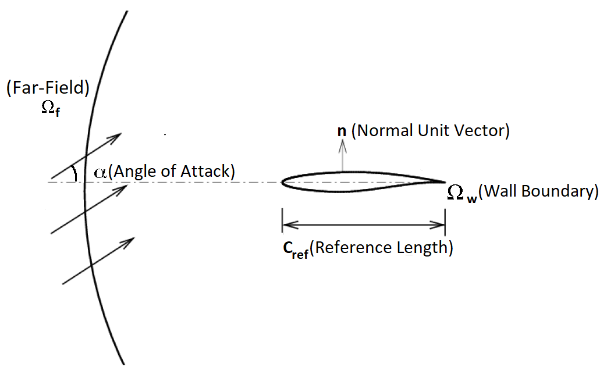
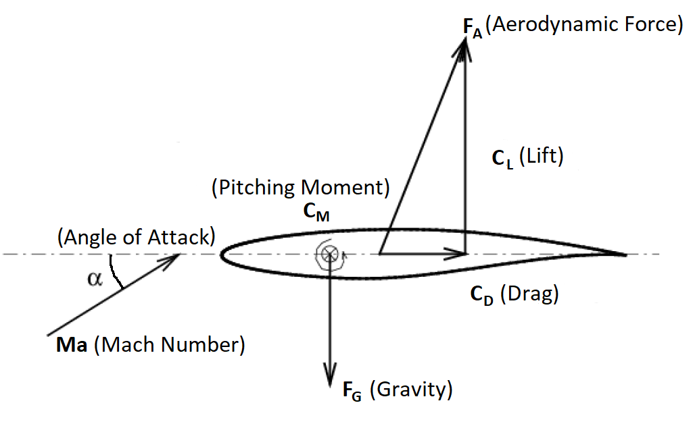
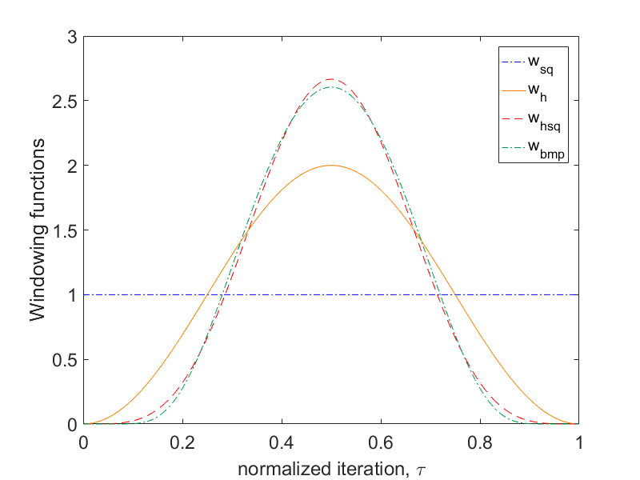
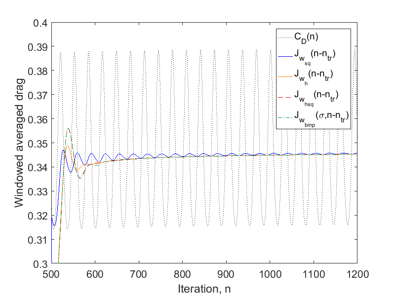
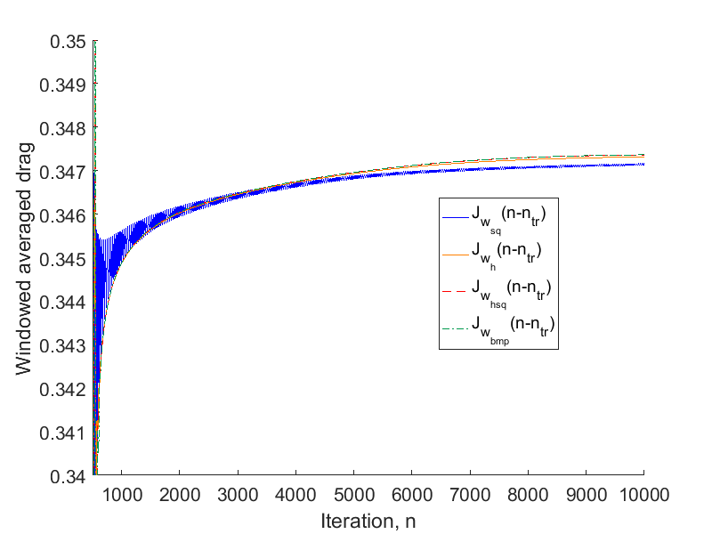

Figure (1): An unsteady, periodic flow field. The detached flow about the airfoil results in a vortex street that repeats itself after some time.

## Goals ##

Upon completing this tutorial, the user will be familiar with performing a simulation of external, viscous, unsteady periodic flows around a 2D geometry using a turbulence model. The specific geometry chosen for the tutorial is the classic NACA0012 airfoil.
Furthermore, the user is introduced in the so-called windowing approach, a regularizing method for time averaging in unsteady periodic flows.
 Consequently, the following capabilities of SU2 will be showcased in this tutorial:
- Unsteady, 2D URANS equations 
- Dual time-stepping for unsteady flows
- Windowing
- Time-convergence
- Code parallelism (optional)

This tutorial also provides an explanation for properly setting up viscous, compressible, unsteady 2D flow conditions in SU2.
We also introduce a new type of time-convergence criteria for periodic flows, which monitors the change of the time-average of a specific objective, such as lift or drag, in order to assess convergence.


## Resources ##

The resources for this tutorial can be found in the [Unsteady_NACA0012](https://github.com/su2code/Tutorials/tree/master/compressible_flow/Unsteady_NACA0012) directory in the [tutorials website repository](https://github.com/su2code/Tutorials). 
You will need the configuration file ([unsteady_naca0012.cfg](https://github.com/su2code/Tutorials/tree/master/compressible_flow/Unsteady_NACA0012/unsteady_naca0012.cfg)) and the mesh file ([unsteady_naca0012_mesh.su2](https://github.com/su2code/Tutorials/tree/master/compressible_flow/Unsteady_NACA0012/unsteady_naca0012_mesh.su2))
as well as the restart files ([restart_flow_00497.dat](https://github.com/su2code/Tutorials/tree/master/compressible_flow/Unsteady_NACA0012/restart_flow_00497.dat), [restart_flow_00498.dat](https://github.com/su2code/Tutorials/tree/master/compressible_flow/Unsteady_NACA0012/restart_flow_00498.dat), [restart_flow_00499.dat](https://github.com/su2code/Tutorials/tree/master/compressible_flow/Unsteady_NACA0012/restart_flow_00499.dat)).

## Tutorial ##

The following tutorial will walk you through the steps required when solving for the flow about the NACA0012 airfoil using SU2. The tutorial will also address procedures for both serial and parallel computations. To this end, it is assumed you have already obtained and compiled SU2_CFD. If you have yet to complete these requirements, please see the [Download](/docs_v7/Download/) and [Installation](/docs_v7/Installation/) pages.

### Background ###

This test case is for the NACA0012 airfoil in viscous unsteady flow. The NACA airfoils are two dimensional shapes for aircraft wings developed by the National Advisory Committee for Aeronautics (NACA, 1915-1958, predeccessor of NASA). The NACA-4-Digit series is a set of 78 airfoil configurations, which were created for wind-tunnel tests to explore the effect of different airfoil shapes on aerdynamic coefficients as drag or lift. 

### Problem Setup ###

This problem will solve the flow about the airfoil with these conditions:
- Freestream Temperature = 293.0 K
- Freestream Mach number = 0.3
- Angle of attack (AOA) = 17.0 deg
- Reynolds number = 1E3
- Reynolds length = 1.0 m

These subsonic flow conditions cause a detached flow on the upper side of the airfoil, which result in a vortex street and therefore periodic behavior.

### Mesh Description ###
The computational domain consists of a grid of 14495 quadrilaterals, that sourrounds the NACA0012 airfoil. Note that this is a very coarse mesh, and should one wish to obtain more accurate solutions for comparison with results in the literature, finer grids should be used. 

Two boundary conditions are employed: the Navier-Stokes adiabatic wall condition on the wing surface and the far-field characteristic-based condition on the far-field marker.


Figure (2): Far-field view of the computational domain.


Figure (3): Close-up view of the airfoil surface and the aerodynamic coefficients.


### Configuration File Options ###

Configuration of the physical problem is similar to the ONERA M6 tutorial, that one can access [here](../Turbulent_ONERAM6). However, contrary to the ONERA M6 case, here a unsteady simulation is performed, hence, the Unsteady RANS (URANS) equations in 2D must be solved.
Unsteady simulations in SU2 are computed by employing a dual time-stepping scheme. To this end, one first performs a spatial discretization as explained in the [ONERA M6](../Turbulent_ONERAM6) tutorial. 
After that, a time discretization in physical time is performed, that results in a residual equation of the form

$$ R(u^n) = 0 \qquad \forall n=1,\dots,N. $$

Here, $$n$$ denotes the current physical time iteration, $$N$$ is the final (physical) time of the simulation, and $$R$$ is the residual, one has to solve. 
In this tutorial, a second order BDF scheme is employed.
The idea of dual time-stepping is, that the current solution $$u^n$$ of the residual equation is computed for each time step by solving an ordinary differential equation in pseudo time $$\tau$$. The ODE for physical time-step $$n$$ reads

$$ \partial_\tau u^n + R(u^n) = 0. $$

Now, a steady state solution for this ODE is computed using the steady state solver. Once a solution is aquired, the residual equation for the next physical time step $$n+1$$ is set up.
As a result there are two time iterators. The inner (pseudo time) iterator and  the outer (physical time) iterator. The number of iterations for the pseudo time iterator is specified by `INNER_ITER` and the number of iterations
for the physical time iterator by `TIME_ITER`. The option `TIME_DOMAIN=YES` activates the time dependent solver in SU2. 
The option `TIME_MARCHING` specifies the numerical method to discretize the time domain in physical time and `TIME_STEP` 
denotes the length of the physical time-step used.
The numerical method to solve the inner (pseudo time) ODE is given by the option `TIME_DISCRE_FLOW`.

```
% -------------UNSTEADY SIMULATION ----------------%
%
TIME_DOMAIN = YES
%
% Numerical Method for Unsteady simulation
TIME_MARCHING= DUAL_TIME_STEPPING-2ND_ORDER
%
% Time Step for dual time stepping simulations (s)
TIME_STEP= 5e-3
%
% Maximum Number of physical time steps.
TIME_ITER= 2200
%
% Number of internal iterations (dual time method)
INNER_ITER= 50
%
% Time discretization for inner iteration.
TIME_DISCRE_FLOW= EULER_IMPLICIT
%
```

This unsteady simulation results in a periodic flow, which can be seen by the vortex street in the flow visualization above. However, since the initial conditions are set to free-stream conditions, a couple of iterations are needed to reach the periodic state.
This time-span is called transient phase. 


Figure (4): Time-dependent drag (black) and lift (red) coefficient. The transient time spans approximately 300 (physical) time-steps.

Usually in a periodic flow an instantaneous output value, e.g. $$C_D(t)$$, is not meaningful. Hence one often uses the average value of one period $$T$$:

$$ \frac{1}{T}\int_0^T C_D(t) \mathcal{d}t$$

However, the exact duration of a period is unknown or cannot be resolved due to a too coarse time discretization. Therefore, 
one averages over a finite time-span $$M$$, which lasts 
a couple of periods and hopes for convergence to the period-average 

$$ \frac{1}{M}\int_0^M C_D(t) \mathcal{d}t.$$

If one employs a weighting function $$w(t)$$, called window-function, the time-average converges faster to the actual period-average

$$ \frac{1}{M}\int_0^M w(t/M)C_D(t) \mathcal{d}t.$$

A windowing function is a function, that is zero on its boundaries $$0$$ and $$M$$ and has integral $$1$$. The iteration 
to start the windowed time-average is specified with `WINDOW_START_ITER`.  Note, that at this iteration the transient phase of the flow must have passed. Otherwise a time average that approximates a period average is not meaningful.
The windowing function can be specified with the option `WINDOW_FUNCTION`.
Note, that windowing functionality also works for sensitivities of time dependent outputs. In this case, the order of convergence is reduced by 1. 
The following options are implemented:

| Window | Convergence Order | Convergence Order (sensitivity) |
| --- | --- | --- |
| `SQUARE`| 1 | 0 |
| `HANN`| 3 | 2 |
| `HANN_SQUARE`| 5 | 4 |
| `BUMP`| exponential | exponential |


Figure (5): Different window-functions in the time span from 0 to 1.

The `SQUARE`-window denotes the case of uniform weighting by 1, i.e. the case, where no windowing-function is applied. It is not recommended to use `SQUARE`- windowing for sensitivities, since no convergence is guaranteed.
For further information about the windowing approach, we refer to the work of Krakos et al. ([Sensitivity Analysis of Limit Cycle Oscillations](https://arc.aiaa.org/doi/abs/10.2514/6.2011-3553 "Sensitivity Analysis of Limit Cycle Oscillations")).
The windowed time-averaged output-field can be accessed in `SCREEN_OUTPUT` by adding the prefix `TAVG_` to the chosen output-field. For 
time-averaged sensitivities, one adds the prefix `D_TAVG_`. 

The windowing functionality can also be used to monitor time convergence. Similar to the steady-state case, a Cauchy-criterion can be employed for flow coefficients. 
The Cauchy-criterion is applied to the windowed time-average from the iteration specified by `WINDOW_START_ITER + CONV_WINDOW_STARTITER` up to the current iteration.
The field  or the list of fields to be monitored can be specified by `CONV_WINDOW_FIELD`.  
The solver will stop, if the average over a certain number of elements (set with `CONV_WINDOW_CAUCHY_ELEMS`) is smaller than the value set with `CONV_WINDOW_CAUCHY_EPS`.
The windowed time-averaged Cauchy criterion can be activated by setting `WINDOW_CAUCHY_CRIT = YES` (default is `NO`). 
If a list of multiple convergence fields is chosen, the sovlver terminates, if the Cauchy criterion is satisfied for all fields in the list.
```
% --- Coefficient-based Windowed Time Convergence Criteria ----%
%
% Activate the windowed cauchy criterion
WINDOW_CAUCHY_CRIT = YES
%
% Specify convergence field(s)
CONV_WINDOW_FIELD= (TAVG_DRAG, TAVG_LIFT)
%
% Number of elements to apply the criteria
CONV_WINDOW_CAUCHY_ELEMS= 100
%
% Epsilon to control the series convergence
CONV_WINDOW_CAUCHY_EPS= 1E-2
%
% Number of iterations to wait after the iteration specified in  WINDOW_START_ITER.
CONV_WINDOW_STARTITER = 10
%
% Iteration to start the windowed time average
WINDOW_START_ITER = 500
%
% Window-function to weight the time average. Options (SQUARE, HANN, HANN_SQUARE, BUMP), SQUARE is default.
WINDOW_FUNCTION = HANN_SQUARE
```
Usually a case is not purely periodic, but the period-mean has a slight shift upwards 
or downwards. Hence, the time-convergence epsilon value is typically not as small as in the time-steady case. 

As one can see in Fig. (4), the transient phase of drag (and lift) is about 500 iterations, thus a suitable starting time for the windowed-average is `WINDOW_START_ITER=500`.
To skip the transient phase (and speed up the tutorial a bit), a restart solution is provided.

```
% Restart after the transient phase has passed
RESTART_SOL = YES
%
% Specify unsteady restart iter
RESTART_ITER = 499 
```

### Running SU2

Instructions for running this test case are given here for both serial and parallel computations.

#### In Serial

The wing mesh should fit on a single-core machine. To run this test case in serial, follow these steps at a terminal command line:
 1. Move to the directory containing the config file (unsteady_NACA0012.cfg) and the mesh file (unsteady_NACA0012_mesh.su2). Make sure that the SU2 tools were compiled, installed, and that their install location was added to your path.
 2. Run the executable by entering in the command line:
      
    ```
    $ SU2_CFD unsteady_NACA0012.cfg
    ```

 3. SU2 will print residual updates with each iteration of the flow solver, and the simulation will terminate after reaching the specified convergence criteria.
 4. Files containing the results will be written upon exiting SU2. The flow solution can be visualized in ParaView (.vtk) or Tecplot (.dat for ASCII).

#### In Parallel

If SU2 has been built with parallel support, the recommended method for running a parallel simulation is through the use of the parallel_computation.py Python script. This automatically handles the domain decomposition and execution with SU2_CFD, and the merging of the decomposed files using SU2_SOL. Follow these steps to run the ONERA M6 case in parallel:
 1. Move to the directory containing the config file ([unsteady_naca0012.cfg](https://github.com/su2code/Tutorials/tree/master/compressible_flow/Unsteady_NACA0012/unsteady_naca0012.cfg)) and the mesh file ([unsteady_naca0012_mesh.su2](https://github.com/su2code/Tutorials/tree/master/compressible_flow/Unsteady_NACA0012/unsteady_naca0012_mesh.su2)). Make sure that the SU2 tools were compiled with parallel support, installed, and that their install location was added to your path.
 2. Run the python script which will automatically call SU2_CFD and will perform the simulation using `NP` number of processors by entering in the command line:

    ```
    $ parallel_computation.py -n NP -f unsteady_NACA0012.cfg
    ```

 3. SU2 will print residual updates with each iteration of the flow solver, and the simulation will terminate after reaching the specified convergence criteria.
 4. The python script will automatically call the `SU2_SOL` executable for generating visualization files from the native restart file written during runtime. The flow solution can then be visualized in ParaView (.vtk) or Tecplot (.dat for ASCII).

### Results

Results for the turbulent flow about the NACA0012 airfoil are shown below. The first picture shows the time dependent 
drag (black) as well as the windowed average from iteration 500 up to the current iteration computed with different 
windowing-functions.
The Hann-Square-windowed time-average set up in this tutorial is displayed by the red line. 
The simulation terminates at iteration 532, since then, the Cauchy time-convergence criteria are satisfied.
The second picture shows a simulation, where the convergence criterion is deactivated. Note, 
that the Square-window oscillates much longer than the other windows, due to its low convergence order.




Figure (6): Comparison of time-averages using different window-functions
