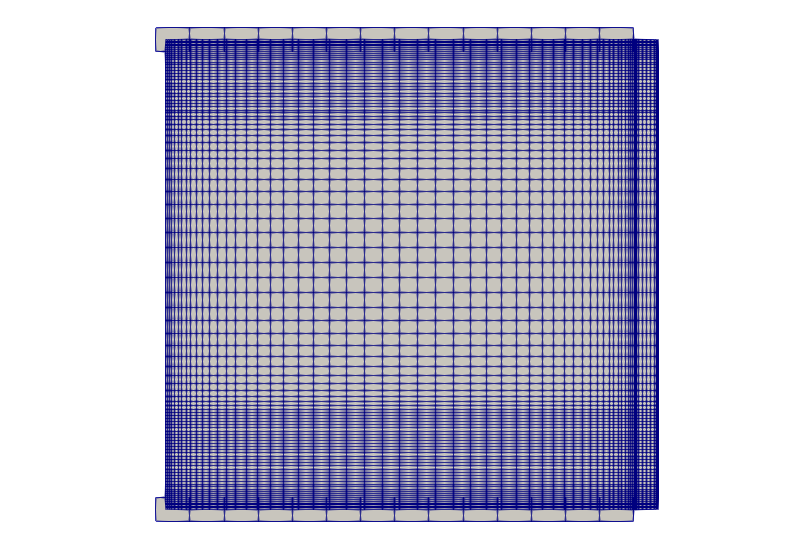
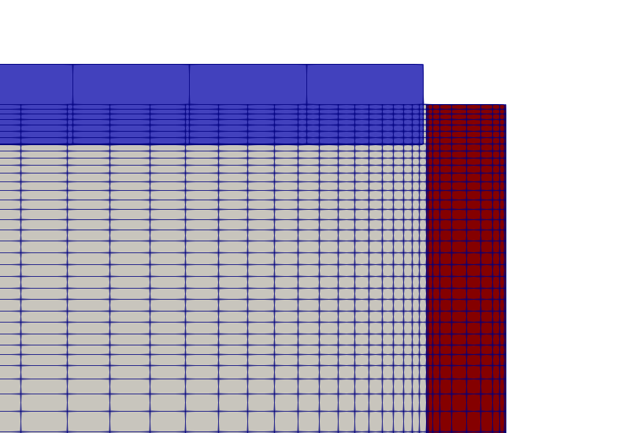

### Goals

This tutorial builds up on SU2's [Conjugate Heat Transfer](../Inc_Heated_Cylinders) and [Radiative Heat Transfer](../Coupled_RHT_Adjoint) capabilities, to solve a multizone, multiphysics problem involving incompressible turbulent flows, radiation, and conjugate heat transfer between a solid domain and a buoyancy-driven cavity. Upon the completion of this example, the user will be capable of
- Setting up a multiphysics simulation with Conjugate Heat Transfer interfaces between zones
- Solving a turbulent buoyancy-driven cavity with participating media and radiation
- Computing coupled adjoint solutions of problems involving incompressible flow and radiation
- Generating multiple FFD boxes to deform the system outer walls
- Projecting the surface sensitivities into the FFD parameters

In this tutorial, we define a problem similar to the [Laminar Buoyancy-Driven Cavity](../Basic_RHT), however using in this case the right wall is a solid wall rather than an isothermal boundary condition. 


Where the inlet velocity is 3 m/s and its temperature is 450 K, while the outlet is a 0 pressure outlet. 

### Resources

For this tutorial, please download the contents of the folder [multiphysics/turb_rht_cht](https://github.com/su2code/Tutorials/blob/feature_radiation_multizone/multiphysics/turb_rht_cht) of the [Tutorials repository](https://github.com/su2code/Tutorials). 

### Background 

CHT simulations become important when we cannot assume an isomthermal wall boundary or suitable temperature distribution estimate. In this tutorial, we assume that this is the case for the right boundary of our buoyancy-driven cavity, and the interface temperature distribution becomes part of the solution of the simulation, by balancing the energy in all physical domains.

#### Mesh Description

The flow domain is discretized using a structured mesh with a total of 4800 elements. The solid domain is discretized using 960 elements. The interface between the domains is matching.

#### FFD Box Generation

First, we define the two FFD boxes to parametrize the upper and lower boundaries of the fluid domain, using 14 design variables per boundary. This is shown next



In order to ensure that the solid domain remains fixed, the FFD boxes are defined so that they do not intersect the CHT boundary. This is shown in detail in the next image, where the red domain corresponds to the solid, and the blue to the FFD box



We define the FFD boxes using the [FFD config file](https://github.com/su2code/Tutorials/blob/feature_radiation_multizone/multiphysics/turb_rht_cht/config_ffd.cfg). In this case, we define 2 boxes using

```
DV_KIND = FFD_SETTING
DV_MARKER = (( upper ), (lower))
DV_PARAM = (( UPPER_BOX, 14, 1, 0.0, 1.0 ), ( LOWER_BOX, 14, 1, 0.0, 1.0 ))
```

where the parameters for each box (```UPPER_BOX``` and ```LOWER_BOX```) are set using

```
FFD_TOLERANCE = 1E-8
FFD_ITERATIONS = 500
FFD_DEFINITION = (UPPER_BOX, -0.02, 0.975, 0.0, 0.998, 0.975, 0.0, 0.998, 1.025, 0.0, -0.02, 1.025, 0.0, 0.0, 0.0, 0.0, 0.0, 0.0, 0.0, 0.0, 0.0, 0.0, 0.0, 0.0, 0.0); (LOWER_BOX, -0.02, -0.025, 0.0, 0.998, -0.025, 0.0, 0.998, 0.025, 0.0, -0.02, 0.025, 0.0, 0.0, 0.0, 0.0, 0.0, 0.0, 0.0, 0.0, 0.0, 0.0, 0.0, 0.0, 0.0)
FFD_DEGREE = ( 14, 1, 0); ( 14, 1, 0)
FFD_CONTINUITY = 2ND_DERIVATIVE
```

We run the following command

```
$ SU2_DEF config_ffd.cfg
```

which returns

```
--------------------- Surface grid deformation (ZONE 0) -----------------
Performing the deformation of the surface grid.
2 Free Form Deformation boxes.
1 Free Form Deformation nested levels.
FFD box tag: UPPER_BOX. FFD box level: 0. Degrees: 14, 1.
FFD Blending using Bezier Curves.
Number of parent boxes: 0. Number of child boxes: 0.
FFD box tag: LOWER_BOX. FFD box level: 0. Degrees: 14, 1.
FFD Blending using Bezier Curves.
Number of parent boxes: 0. Number of child boxes: 0.

----------------- FFD technique (cartesian -> parametric) ---------------
Compute parametric coord      | FFD box: UPPER_BOX. Max Diff: 2.28878e-16.
Compute parametric coord      | FFD box: LOWER_BOX. Max Diff: 2.22045e-16.
Writing a Paraview file of the FFD boxes.
No surface deformation (setting FFD).

----------------------- Write deformed grid files -----------------------
|SU2 mesh                           |mesh_flow_ffd.su2                  |
Adding any FFD information to the SU2 file.
```

In order to confirm that both FFD boxes information has been added to the mesh file, we open ```mesh_flow_ffd.su2``` and check that the FFD information has been appended to the file

```
FFD_NBOX= 2
FFD_NLEVEL= 1
FFD_TAG= UPPER_BOX
FFD_LEVEL= 0
FFD_DEGREE_I= 14
FFD_DEGREE_J= 1
FFD_BLENDING= BEZIER
FFD_PARENTS= 0
FFD_CHILDREN= 0
FFD_CORNER_POINTS= 4
-0.02	0.975
0.998	0.975
0.998	1.025
-0.02	1.025
FFD_CONTROL_POINTS= 60
0	0	0	-0.02	0.975	-0.5
0	0	1	-0.02	0.975	0.5
0	1	0	-0.02	1.025	-0.5
0	1	1	-0.02	1.025	0.5
...
14	0	0	0.998	0.975	-0.5
14	0	1	0.998	0.975	0.5
14	1	0	0.998	1.025	-0.5
14	1	1	0.998	1.025	0.5
FFD_SURFACE_POINTS= 50
upper	103	2.368368087162328e-02	4.999999999999987e-01	5.000000000000000e-01
upper	5	1.964636542239686e-02	4.999999999999987e-01	5.000000000000000e-01
...
upper	150	9.932979180545798e-01	5.000000000000000e-01	5.000000000000000e-01
upper	151	9.979273210929932e-01	5.000000000000000e-01	5.000000000000000e-01
FFD_TAG= LOWER_BOX
FFD_LEVEL= 0
FFD_DEGREE_I= 14
FFD_DEGREE_J= 1
FFD_BLENDING= BEZIER
FFD_PARENTS= 0
FFD_CHILDREN= 0
FFD_CORNER_POINTS= 4
-2.000000000000000e-02	-2.500000000000000e-02
9.980000000000000e-01	-2.500000000000000e-02
9.980000000000000e-01	2.500000000000000e-02
-2.000000000000000e-02	2.500000000000000e-02
FFD_CONTROL_POINTS= 60
0	0	0	-2.000000000000000e-02	-2.500000000000000e-02	-5.000000000000000e-01
0	0	1	-2.000000000000000e-02	-2.500000000000000e-02	5.000000000000000e-01
0	1	0	-2.000000000000000e-02	2.500000000000000e-02	-5.000000000000000e-01
0	1	1	-2.000000000000000e-02	2.500000000000000e-02	5.000000000000000e-01
...
14	0	0	9.980000000000000e-01	-2.500000000000000e-02	-5.000000000000000e-01
14	0	1	9.980000000000000e-01	-2.500000000000000e-02	5.000000000000000e-01
14	1	0	9.980000000000000e-01	2.500000000000000e-02	-5.000000000000000e-01
14	1	1	9.980000000000000e-01	2.500000000000000e-02	5.000000000000000e-01
FFD_SURFACE_POINTS= 50
lower	243	9.979273210929928e-01	5.000000000000000e-01	5.000000000000000e-01
lower	244	9.932979180545780e-01	5.000000000000000e-01	5.000000000000000e-01
...
lower	291	2.368368087164354e-02	5.000000000000000e-01	5.000000000000000e-01
lower	0	1.964636542239686e-02	5.000000000000000e-01	5.000000000000000e-01
```

### Multiphysics Configuration File

We start the tutorial by [definining the problem as a multiphysics case](https://github.com/su2code/Tutorials/blob/feature_radiation_multizone/multiphysics/turb_rht_cht/turbulent_rht_cht.cfg),

```
SOLVER = MULTIPHYSICS
```

We set the config files for each sub-problem using the command ```CONFIG_LIST```, and state that each sub-problem will use a different mesh file:

```
MULTIZONE_MESH = NO
CONFIG_LIST = (config_flow_rht.cfg, config_solid_cht.cfg)
```

Now, we define the coupling conditions. In this case, the interface between the marker ```right``` in the flow domain, and ```leftSolid``` in the solid domain, is defined as

```
MARKER_ZONE_INTERFACE= (right, leftSolid)
```

We define the number of outer iterations for the multizone problem for a maximum of 30000 outer iterations

```
OUTER_ITER = 30000
```

Then, the convergence criteria is set to evaluate the averaged residual of the flow state vector (zone 0) (```AVG_BGS_RES[0]```) and the solid temperature (zone 1) (```AVG_BGS_RES[1]```) in two consecutive outer iterations, $$\mathbf{w}^{n+1}-\mathbf{w}^{n}$$ and $$\mathrm{T}^{n+1}-\mathrm{T}^{n}$$ respectively.

```
CONV_FIELD = AVG_BGS_RES[0], AVG_BGS_RES[1]
CONV_RESIDUAL_MINVAL = -8
```

The last step is defining our desired output. In this tutorial, we will use the following configuration for the history output

```
OUTPUT_WRT_FREQ = 1000
OUTPUT_FILES = (RESTART, PARAVIEW)
TABULAR_FORMAT= CSV

HISTORY_OUTPUT = (ITER, RMS_RES[0], HEAT[0], RMS_RES[1])
```

where the restart and paraview solution files are written every 1000 iterations, and the residuals of both zones and the heat properties of zone 1 are written to the history file, which has the same name as the config file but with extension .csv. 

#### Applying simulation conditions to the individual domains: Flow domain

The flow domain is defined in ```config_flow_rht.cfg```. An incompressible, Renolds-Averaged Navier Stokes simulation with an SST turbulence model is set

```
SOLVER = INC_RANS
KIND_TURB_MODEL = SST
```

We set the properties for the flow according to the problem definition

```
INC_DENSITY_MODEL = VARIABLE
INC_ENERGY_EQUATION = YES
INC_VELOCITY_INIT = ( 1.0, 0.0, 0.0 )
INC_DENSITY_INIT = 0.006
INC_TEMPERATURE_INIT = 450

INC_NONDIM = DIMENSIONAL

VISCOSITY_MODEL = CONSTANT_VISCOSITY
MU_CONSTANT = 1e-5

CONDUCTIVITY_MODEL = CONSTANT_CONDUCTIVITY
KT_CONSTANT = 0.01

FLUID_MODEL = INC_IDEAL_GAS
SPECIFIC_HEAT_CP = 1000
MOLECULAR_WEIGHT = 30

BODY_FORCE = YES
BODY_FORCE_VECTOR = ( 0.0, -9.81, 0.0 )
```

And the radiation model is defined as

```
RADIATION_MODEL = P1
MARKER_EMISSIVITY = ( upper, 0.0, lower, 0.0, left, 1.0, right, 1.0, inlet, 1.0, outlet, 1.0 )
ABSORPTION_COEFF = 1.0
CFL_NUMBER_RAD = 1E12
TIME_DISCRE_RADIATION = EULER_IMPLICIT
```

We incorporate a volumetric heat source in the form of an ellipse with principal axes $$a = 0.2$$, $$b = 0.05$$, centered at $$(0.2,0.875,0)$$, to mimic the effect of a flame in the domain

```
HEAT_SOURCE = YES
HEAT_SOURCE_VAL = 50000
HEAT_SOURCE_ROTATION_Z = 0
HEAT_SOURCE_CENTER = (0.2,0.875,0)
HEAT_SOURCE_AXES = (0.2,0.05,0)
```

Next, the flow boundary conditions are applied

```
MARKER_ISOTHERMAL = ( left, 600.0 )
MARKER_HEATFLUX = ( upper, 0.0, lower, 0.0 )
MARKER_PLOTTING = ( right )
MARKER_MONITORING = ( right )

INC_INLET_TYPE = VELOCITY_INLET
MARKER_INLET = ( inlet, 450.0, 3.0, 1.0, 0.0, 0.0)

INC_OUTLET_TYPE = PRESSURE_OUTLET
MARKER_OUTLET = ( outlet, 0.0 )
```

and the ```right``` boundary is defined as a CHT interface

```
MARKER_CHT_INTERFACE = (right)
```

#### Applying simulation conditions to the individual domains: Solid domain

The solid domain is defined in ```config_solid_cht.cfg```. Only the heat equation is considered by the solver

```
SOLVER = HEAT_EQUATION
```

The properties of the solid domain are defined next

```
SOLID_TEMPERATURE_INIT = 300.0
SOLID_DENSITY = 2000

SPECIFIC_HEAT_CP = 1000.0
SOLID_THERMAL_CONDUCTIVITY = 1.0

INC_NONDIM = DIMENSIONAL
```

And the boundary conditions are, for this case

```
MARKER_ISOTHERMAL = ( rightSolid, 300.0,  upperSolid, 300.0,  lowerSolid, 300.0)
MARKER_MONITORING = ( NONE )
```

while the coupling conditions are defined using

```
MARKER_CHT_INTERFACE = (leftSolid)
```

### Running the primal simulation

We now run the simulation in parallel with 2 cores, using

```
$ mpirun -n 2 SU2_CFD turbulent_rht_cht.cfg 
```

and we obtain

```
+--------------------------------------+
|           Multizone Summary          |
+--------------------------------------+
|  Outer_Iter| avg[bgs][0]| avg[bgs][1]|
+--------------------------------------+
|           0|    0.376042|   -0.201907|
|           1|    0.308690|   -0.837103|
|           2|    0.130097|   -1.039244|
|           3|   -0.060423|   -1.232387|
|           4|   -0.194779|   -1.419352|
|           5|   -0.345477|   -1.592573|
|           6|   -0.447955|   -1.744954|
|           7|   -0.521272|   -1.874409|
|           8|   -0.540495|   -1.980951|
|           9|   -0.594882|   -2.067258|
|          10|   -0.651959|   -2.138538|
...
|       14000|   -7.822037|   -5.978975|
|       14001|   -7.822255|   -5.979198|
|       14002|   -7.822479|   -5.979420|
|       14003|   -7.822697|   -5.979642|
|       14004|   -7.822920|   -5.979864|
|       14005|   -7.823138|   -5.980086|
|       14006|   -7.823362|   -5.980308|
|       14007|   -7.823580|   -5.980530|
|       14008|   -7.823803|   -5.980752|
|       14009|   -7.824021|   -5.980975|
|       14010|   -7.824245|   -5.981197|
...
|       23115|   -9.831339|   -7.997863|
|       23116|   -9.831563|   -7.998084|
|       23117|   -9.831779|   -7.998305|
|       23118|   -9.832003|   -7.998526|
|       23119|   -9.832220|   -7.998747|
|       23120|   -9.832443|   -7.998968|
|       23121|   -9.832661|   -7.999189|
|       23122|   -9.832884|   -7.999410|
|       23123|   -9.833101|   -7.999631|
|       23124|   -9.833324|   -7.999852|
|       23125|   -9.833541|   -8.000073|
```

We need to converge the problem thoroughly in order to obtain a converged heatflux at the CHT boundary, as this will be our objective function for adjoint purposes. From the history file, we can observe that, although the residuals have been reduced by 5 and 7 orders of magnitude respectively after 14000 iterations, the heaflux is not yet fully converged, and it takes almost another 10000 iterations to converge

```
"Time_Iter","Outer_Iter","Inner_Iter",      "HF[0]"     ,    "maxHF[0]"    
          0,           0,           0,       4781.631841,       8284.801073
          0,           1,           0,        206.661296,       407.9247674
          0,           2,           0,       157.8829329,        305.847306
          0,           3,           0,       129.1211842,       247.3569023
          0,           4,           0,       114.5644202,       217.9004096
          0,           5,           0,       107.1377363,       202.2141012
          0,           6,           0,       102.9648849,       193.3549536
          0,           7,           0,       100.6066882,       188.5484424
          0,           8,           0,       99.04567981,       185.4970227
          0,           9,           0,       97.67690982,       182.8558711
          0,          10,           0,       96.36114436,       180.2696727
...
          0,       14000,           0,       113.1030141,       200.7535431
          0,       14001,           0,       113.1030134,       200.7535423
          0,       14002,           0,       113.1030127,       200.7535414
          0,       14003,           0,       113.1030119,       200.7535406
          0,       14004,           0,       113.1030112,       200.7535398
          0,       14005,           0,       113.1030105,       200.7535389
          0,       14006,           0,       113.1030098,       200.7535381
          0,       14007,           0,        113.103009,       200.7535373
          0,       14008,           0,       113.1030083,       200.7535364
          0,       14009,           0,       113.1030076,       200.7535356
          0,       14010,           0,       113.1030069,       200.7535348
...
          0,       23116,           0,       113.1015985,       200.7519326
          0,       23117,           0,       113.1015985,       200.7519326
          0,       23118,           0,       113.1015985,       200.7519326
          0,       23119,           0,       113.1015985,       200.7519326
          0,       23120,           0,       113.1015985,       200.7519326
          0,       23121,           0,       113.1015985,       200.7519325
          0,       23122,           0,       113.1015985,       200.7519325
          0,       23123,           0,       113.1015985,       200.7519325
          0,       23124,           0,       113.1015985,       200.7519325
          0,       23125,           0,       113.1015985,       200.7519325
```

The temperature and velocity fields for the primal settings are as follows


### Running the adjoint simulation

Only the following minor changes are required to the multiphysics adjoint file, [turbulent_rht_cht_adjoint.cfg](https://github.com/su2code/Tutorials/blob/feature_radiation_multizone/multiphysics/turb_rht_cht/turbulent_rht_cht_adjoint.cfg), to compute the adjoint of the integrated heatflux through the CHT boundary:

```
MATH_PROBLEM = DISCRETE_ADJOINT
OBJECTIVE_FUNCTION = TOTAL_HEATFLUX
```

Then, the restart files need to be renamed as solution files, ```restart_flow_rht_0.dat``` &rarr; ```solution_flow_rht_0.dat``` and ```restart_solid_cht_1.dat``` &rarr; ```solution_solid_cht_1.dat```. We run the adjoint in parallel using

```
$ mpirun -n 2 SU2_CFD_AD turbulent_rht_cht_adjoint.cfg
```

The simulation starts from the converged point

```
-------------------------------------------------------------------------
Storing computational graph wrt CONSERVATIVE VARIABLES.
 Objective function                   : 113.102
 Zone 0 (flow)       - log10[U(0)]    : -15.7308
 Zone 0 (turbulence) - log10[Turb(0)] : -14.9704
 Zone 0 (radiation)  - log10[Rad(0)]  : -7.60211
 Zone 1 (heat)       - log10[Heat(0)] : -11.9829
-------------------------------------------------------------------------
```

and the simulation converges quickly 

```
+--------------------------------------+
|           Multizone Summary          |
+--------------------------------------+
|  Outer_Iter| avg[bgs][0]| avg[bgs][1]|
+--------------------------------------+
|           0|    0.000000|    0.000000|
|           1|   -2.963087|   -2.536124|
|           2|   -2.938999|   -2.493938|
|           3|   -3.079946|   -2.573465|
|           4|   -3.135020|   -2.624314|
|           5|   -3.213446|   -2.669019|
|           6|   -3.261026|   -2.710054|
|           7|   -3.293646|   -2.746341|
|           8|   -3.329728|   -2.776762|
|           9|   -3.364945|   -2.801132|
|          10|   -3.393157|   -2.820130|
...
|        8856|   -5.662248|   -4.997821|
|        8857|   -5.662245|   -4.998039|
|        8858|   -5.662248|   -4.998258|
|        8859|   -5.662245|   -4.998477|
|        8860|   -5.662248|   -4.998696|
|        8861|   -5.662245|   -4.998914|
|        8862|   -5.662248|   -4.999133|
|        8863|   -5.662245|   -4.999351|
|        8864|   -5.662248|   -4.999570|
|        8865|   -5.662245|   -4.999788|
|        8866|   -5.662248|   -5.000007|
```

### Projecting the adjoint into the FFD box parameters

The same configuration file can be used with ```SU2_DOT_AD``` to project the sensitivities of the heatflux into the design parameters. We need to rename the adjoint solutions ```restart_adj_flow_rht_totheat_0.dat``` &rarr; ```solution_adj_flow_rht_totheat_0.dat ``` and ```restart_adj_solid_cht_totheat_1.dat``` &rarr; ```solution_adj_solid_cht_totheat_1.dat```

It is important to adequately define the projections settings ```config_flow_rht.cfg```. Only the leftmost 12 points of each FFD boxes will be used, as the other 3 are kept still by SU2 to ensure continuity on the 2nd derivative.

```
DV_KIND= FFD_CONTROL_POINT_2D, FFD_CONTROL_POINT_2D, ..., FFD_CONTROL_POINT_2D, FFD_CONTROL_POINT_2D,
DV_MARKER = (( upper ), (lower))
DV_PARAM = ( UPPER_BOX, 0, 1, 0.0, 1.0 ); ( UPPER_BOX, 1, 1, 0.0, 1.0 ); ( UPPER_BOX, 10, 1, 0.0, 1.0 ); ( UPPER_BOX, 11, 1, 0.0, 1.0 ); ( LOWER_BOX, 0, 0, 0.0, 1.0 ); ( LOWER_BOX, 1, 0, 0.0, 1.0 ); ( LOWER_BOX, 10, 0, 0.0, 1.0 ); ( LOWER_BOX, 11, 0, 0.0, 1.0 )
DV_VALUE = 0.0, 0.0, 0.0, 0.0, 0.0, 0.0, 0.0, 0.0, 0.0, 0.0, 0.0, 0.0, 0.0, 0.0, 0.0, 0.0, 0.0, 0.0, 0.0, 0.0, 0.0, 0.0, 0.0, 0.0
```

We run the projection software

```
$ SU2_DOT_AD turbulent_rht_cht_adjoint.cfg
```

which yields the following projected gradients


```
Design variable (FFD_CONTROL_POINT_2D) number 0.
TOTAL_HEATFLUX gradient : 9.29141
-------------------------------------------------------------------------

Design variable (FFD_CONTROL_POINT_2D) number 1.
TOTAL_HEATFLUX gradient : 5.70395
-------------------------------------------------------------------------

...

Design variable (FFD_CONTROL_POINT_2D) number 22.
TOTAL_HEATFLUX gradient : -1.41853
-------------------------------------------------------------------------

Design variable (FFD_CONTROL_POINT_2D) number 23.
TOTAL_HEATFLUX gradient : -1.36538
-------------------------------------------------------------------------
```

The sensitivities for the FFD points are written to the file ```of_grad.dat```.

### Deforming the domain for design purposes  

An example on how to deform the mesh is provided in [sample_ffd_deform.cfg](https://github.com/su2code/Tutorials/blob/feature_radiation_multizone/multiphysics/turb_rht_cht/sample_ffd_deform.cfg). We define the input mesh as ```mesh_flow_ffd.su2``` and the output as ```mesh_flow_ffd_deform.su2```.

```
MESH_FORMAT = SU2
MESH_FILENAME = mesh_flow_ffd.su2
MESH_OUT_FILENAME = mesh_flow_ffd_deform.su2
```

We define the design variables for this example as

```
DV_VALUE = 0.0, 0.05, 0.1, 0.14, 0.16, 0.17, 0.175, 0.17, 0.16, 0.14, 0.1, 0.05, 0.0, -0.05, -0.1, -0.14, -0.16, -0.17, -0.175, -0.17, -0.16, -0.14, -0.1, -0.05
```

and we run the ```SU2_DEF``` binary to deform the mesh

```
SU2_DEF sample_ffd_deform.cfg
```

By substituting the input mesh into the flow configuration file

```
MESH_FILENAME= mesh_flow_ffd_deform.su2
```

it is possible to run a deformed primal simulation. The temperature and velocity fields for this particular deformed configuration are as follows


### Attribution

If you are using this content for your research, please kindly cite the following reference in your derived works:

Sanchez, R. _et al._ (2020), Adjoint-based sensitivity analysis in high-temperaturefluid flows with participating media, _(Submitted to) Modeling, Simulation and Optimization in the Health- and Energy-Sector, SEMA SIMAI SPRINGER SERIES_

<dl>
This work is licensed under a <a rel="license" href="http://creativecommons.org/licenses/by/4.0/">Creative Commons Attribution 4.0 International License</a>
<br />
<a rel="license" href="http://creativecommons.org/licenses/by/4.0/"></a>
</dl>

